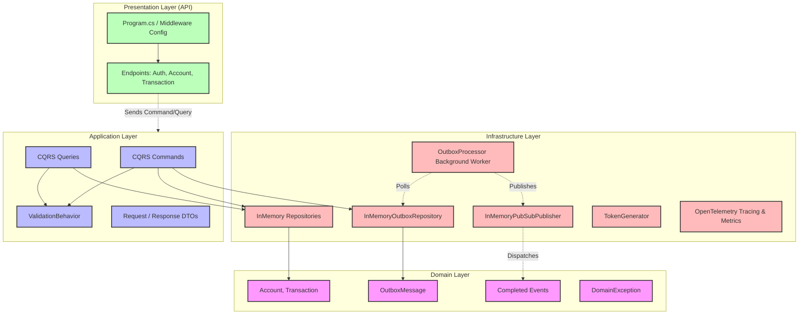
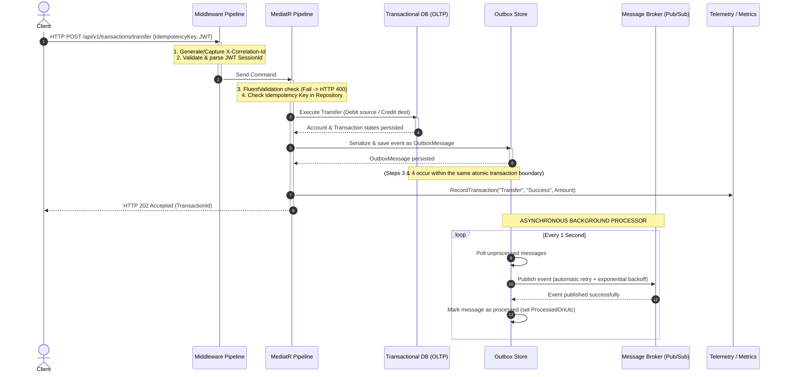

# Architecture & Component Design

The project strictly follows **Clean Architecture** principles, decoupling business rules from external concerns.



### Layer Breakdown

1. **[Domain](file:///home/wt/Development/entrevistas/qt_bank/QtBank.Api/Domain)**: Holds core enterprise models ([Account](file:///home/wt/Development/entrevistas/qt_bank/QtBank.Api/Domain/Models/Account.cs), [Transaction](file:///home/wt/Development/entrevistas/qt_bank/QtBank.Api/Domain/Models/Transaction.cs), [OutboxMessage](file:///home/wt/Development/entrevistas/qt_bank/QtBank.Api/Domain/Models/OutboxMessage.cs)), repository interfaces ([IAccountRepository](file:///home/wt/Development/entrevistas/qt_bank/QtBank.Api/Domain/Repositories/IAccountRepository.cs), [ITransactionRepository](file:///home/wt/Development/entrevistas/qt_bank/QtBank.Api/Domain/Repositories/ITransactionRepository.cs), [IOutboxRepository](file:///home/wt/Development/entrevistas/qt_bank/QtBank.Api/Domain/Repositories/IOutboxRepository.cs)), Domain Events, and Exceptions. Zero dependencies on outer layers.
2. **[Application](file:///home/wt/Development/entrevistas/qt_bank/QtBank.Api/Application)**: Orchestrates business use cases using MediatR. Contains Queries ([GetAccountBalanceQuery](file:///home/wt/Development/entrevistas/qt_bank/QtBank.Api/Application/Accounts/Queries/GetAccountBalanceQuery.cs), [GetAccountTransactionsQuery](file:///home/wt/Development/entrevistas/qt_bank/QtBank.Api/Application/Transactions/Queries/GetAccountTransactionsQuery.cs)), Commands ([DepositCommand](file:///home/wt/Development/entrevistas/qt_bank/QtBank.Api/Application/Transactions/Commands/DepositCommand.cs), [WithdrawalCommand](file:///home/wt/Development/entrevistas/qt_bank/QtBank.Api/Application/Transactions/Commands/WithdrawalCommand.cs), [TransferCommand](file:///home/wt/Development/entrevistas/qt_bank/QtBank.Api/Application/Transactions/Commands/TransferCommand.cs)), DTOs, and Validators, with cross-cutting validation handled by [ValidationBehavior](file:///home/wt/Development/entrevistas/qt_bank/QtBank.Api/Application/Behaviors/ValidationBehavior.cs).
3. **[Infrastructure](file:///home/wt/Development/entrevistas/qt_bank/QtBank.Api/Infrastructure)**: Handles cross-cutting concerns, repository implementations ([InMemoryAccountRepository](file:///home/wt/Development/entrevistas/qt_bank/QtBank.Api/Infrastructure/Repositories/InMemoryAccountRepository.cs), [InMemoryTransactionRepository](file:///home/wt/Development/entrevistas/qt_bank/QtBank.Api/Infrastructure/Repositories/InMemoryTransactionRepository.cs), [InMemoryOutboxRepository](file:///home/wt/Development/entrevistas/qt_bank/QtBank.Api/Infrastructure/Repositories/InMemoryOutboxRepository.cs)), the hosted [OutboxProcessor](file:///home/wt/Development/entrevistas/qt_bank/QtBank.Api/Infrastructure/Outbox/OutboxProcessor.cs) background worker, token generator ([TokenGenerator](file:///home/wt/Development/entrevistas/qt_bank/QtBank.Api/Infrastructure/Security/TokenGenerator.cs)), telemetry registration ([TelemetryServiceCollectionExtensions](file:///home/wt/Development/entrevistas/qt_bank/QtBank.Api/Infrastructure/Telemetry/TelemetryServiceCollectionExtensions.cs)), application metrics collection ([ApplicationMetrics](file:///home/wt/Development/entrevistas/qt_bank/QtBank.Api/Infrastructure/Telemetry/ApplicationMetrics.cs)), and messaging publishers ([InMemoryPubSubPublisher](file:///home/wt/Development/entrevistas/qt_bank/QtBank.Api/Infrastructure/Messaging/InMemoryPubSubPublisher.cs)).
4. **Presentation (API)**: Exposes routes via Minimal API endpoints ([AccountEndpoints](file:///home/wt/Development/entrevistas/qt_bank/QtBank.Api/Infrastructure/Endpoints/v1/AccountEndpoints.cs), [AuthEndpoints](file:///home/wt/Development/entrevistas/qt_bank/QtBank.Api/Infrastructure/Endpoints/v1/AuthEndpoints.cs), [TransactionEndpoints](file:///home/wt/Development/entrevistas/qt_bank/QtBank.Api/Infrastructure/Endpoints/v1/TransactionEndpoints.cs)), configures the ASP.NET Core DI container and request/response middlewares in [Program.cs](file:///home/wt/Development/entrevistas/qt_bank/QtBank.Api/Program.cs).

---

## 🎨 API Design System

The API is architected around a robust design system for processing financial transactions. The following sequence diagram visualizes how incoming HTTP requests flow through the pipeline, enforcing correlation, validation, security, database transactional consistency (outbox), and observability recording.



### Core Design Patterns & Principles

1. **Protocol Semantics**: Clean usage of REST HTTP verbs and status codes:
   - `GET` for idempotent queries (`200 OK` or `404 Not Found`).
   - `POST` for command execution (`202 Accepted` for queued transactions).
   - `400 Bad Request` or `422 Unprocessable` for input schema and business validation errors.
2. **Atomic Transaction Boundary**: Ensures write consistency. Changes to `Account` and `Transaction` records are committed to the data store in the exact same transaction block as the `OutboxMessage` event queue entry.
3. **Vendor-Agnostic Metrics Contract**: Emits metrics using standard .NET `System.Diagnostics.Metrics` APIs, completely decoupling application codebase from vendor-specific libraries (e.g. Datadog, Prometheus, Azure Monitor).
4. **Resiliency Loop**: Worker executes retries with exponential backoff on transient network issues when delivering events to the message broker.


### Project Structure

Below is the directory tree layout of the solution:

```text
qt_bank/
├── QtBank.sln                 # .NET Solution File
├── Dockerfile                 # Containerization Config
├── docker-compose.yml         # Compose configuration
├── docs/                      # Sub-topic Documentation files
│   ├── architecture.md
│   ├── getting-started.md
│   ├── api-reference.md
│   ├── production-design.md
│   └── ai-retrospective.md
├── QtBank.Api/                # Main Web API Project
│   ├── Domain/                # Enterprise models & Repository Interfaces
│   ├── Application/           # CQRS MediatR Handlers & Business Logic
│   ├── Infrastructure/        # Telemetry, Security, Outbox, & Data stores
│   └── Program.cs             # API Startup & Pipelines Configuration
└── QtBank.Api.Tests/          # Unit & Integration Tests Suite
    ├── Domain/                # Enterprise models & Repository Interfaces Tests
    ├── Application/           # Command & Query Handler Tests
    └── Infrastructure/        # Observability, Outbox, & Middleware Tests
```